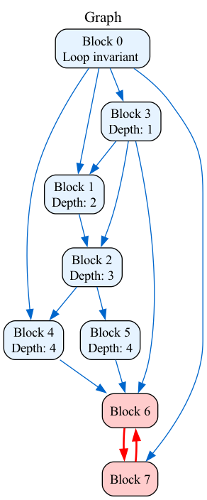
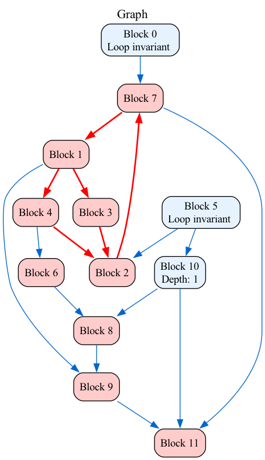

# Cycles

## Overvie

This project represents VGD(Variable Dependancy Graph) with it's generation and search for quasi-invariants. To find quasi invariants we find all loops in the graph and find nodes, reachable from the graph. Every unreachable variable is quasi-invariant. Finally for every quasi-invariant  we find longest path to the reachable from the loop variable and the length of this path is the iteration, when our variable can be taken out from the cycle

## Features

- **Cycles Analysis**: Finds all cycles in thr graph.
- **Quasi-invariants search**: Finds quasi-invariants in graph.
- **Quasi-invariants depth analysys**: Finds depth of all quasi-invariants.
- **Graph Visualization**: Generates visual representations of each computed graph.

## Project Structure

```t
Cycles/
├── inc/
│   ├── BasicBlock.h        # BasicBlock representation
│   └── Graph.h             # Main Graph class with different methods
├── src/
│   ├── Graph.cc            # Implementation of Graph nethods
│   └── main.cc             # Test for different graphs
├── src/                    
│   ├── *.png               # Directory where all dumped 
│   ...                     # graphs are saved by default
│   └── *.png
├── CMakeLists.txt          # Build configuration
└── README.md
```

## Building and Running

### Prerequisites

- C++20 compatible compiler (GCC 10+, Clang 12+)
- CMake 3.6+

### Build Instructions

```bash
mkdir build && cd build

cmake ..

make

./Cycles
```

All graphs dumps are saved in ```plots/``` by default

## Examples

Some randomly generated graphs

<table>
  <tr valign="top">
    <td></td>
    <td></td>
  </tr>
</table>

<table>
  <tr valign="top">
    <td></td>
    <td></td>
  </tr>
</table>
